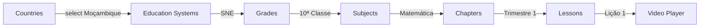

# 🧪 Guia de Testes de Navegação - VClass

**Data**: 09/04/2026  
**Versão**: 1.6.1  
**Status**: Modo Demo Ativo ✅

---

## 📋 Índice

1. [Problema Identificado](#problema-identificado)
2. [Solução Implementada](#solução-implementada)
3. [URLs de Teste](#urls-de-teste)
4. [Fluxo de Navegação](#fluxo-de-navegação)
5. [Estrutura de Dados Mock](#estrutura-de-dados-mock)
6. [Como Testar](#como-testar)
7. [Resolução de Problemas](#resolução-de-problemas)

---

## 🔍 Problema Identificado

### Sintoma
- Usuário relatou que ao clicar em **país** na página Browse, **nenhum conteúdo** era exibido
- Erro: "Data configuration missing"

### Causa Raiz
1. **APIs funcionando corretamente** ✅
   - `/api/content/countries` - retorna países
   - `/api/content/education-systems/:country_id` - retorna sistemas educacionais
   - `/api/content/grades/:education_system_id` - retorna séries
   - `/api/content/subjects/:grade_id` - retorna disciplinas

2. **Problema de Autenticação** ❌
   - Página `browse.html` exigia login
   - Redirecionava para `/login.html` antes de carregar dados
   - APIs de progresso falhavam sem token JWT

---

## ✅ Solução Implementada

### 1. **Modo Demo em Browse.html**
```javascript
// DEMO MODE: Set fake authentication for testing
const isDemoMode = true; // Set to false to require login

if (isDemoMode && !VClass.isAuthenticated()) {
    // Set demo token to bypass auth checks
    localStorage.setItem('accessToken', 'demo_token');
    localStorage.setItem('user', JSON.stringify({
        id: 'demo',
        email: 'demo@vclass.mz',
        full_name: 'Demo User',
        role: 'student'
    }));
}
```

**Benefícios**:
- ✅ Permite teste de navegação sem login
- ✅ Simula usuário autenticado
- ✅ Não quebra funcionalidades protegidas
- ✅ Fácil desativar (`isDemoMode = false`)

### 2. **Página de Teste Dedicada**
Criada `/test-browse.html` com:
- Botões para testar cada API individualmente
- Visualização JSON dos resultados
- Links diretos para páginas de conteúdo
- Instruções de teste

---

## 🔗 URLs de Teste

### Servidor Local
```
http://localhost:3000/test-browse.html         # Página de testes de API
http://localhost:3000/browse.html              # Browse com modo demo
http://localhost:3000/chapters.html?gs=...     # Chapters direto
http://localhost:3000/lesson.html?id=...       # Lesson direto
```

### Sandbox Público
```
https://3000-ia6r8c8trneyl04o4nl6o-ecea8f22.sandbox.novita.ai/test-browse.html
https://3000-ia6r8c8trneyl04o4nl6o-ecea8f22.sandbox.novita.ai/browse.html
```

---

## 🗺️ Fluxo de Navegação

### Completo: País → Sistema → Série → Disciplina → Capítulo → Lição



### Etapas Detalhadas

#### 1️⃣ **Países** (`/browse.html`)
```javascript
GET /api/content/countries
→ [Moçambique, Brasil, Angola, Portugal]
```

**Cards exibidos**:
- 🇲🇿 Moçambique
- 🇧🇷 Brasil  
- 🇦🇴 Angola  
- 🇵🇹 Portugal

#### 2️⃣ **Sistemas Educacionais** (mesmo `/browse.html`)
```javascript
selectCountry(countryId, countryName)
→ GET /api/content/education-systems/22222222-2222-2222-2222-222222222222
→ [Sistema Nacional de Ensino]
```

#### 3️⃣ **Séries** (mesmo `/browse.html`)
```javascript
GET /api/content/grades/es-11111111-1111-1111-1111-111111111111
→ [10ª Classe, 11ª Classe, 12ª Classe]
```

**Cards exibidos**:
- 🎓 10ª Classe (Ensino Secundário)
- 🎓 11ª Classe
- 🎓 12ª Classe

#### 4️⃣ **Disciplinas** (mesmo `/browse.html`)
```javascript
GET /api/content/subjects/gr-10-moz
→ [Matemática, Português, Física, Química, Biologia]
```

**Cards exibidos**:
- 🔢 Matemática (roxo)
- 📚 Português (azul)
- ⚡ Física (verde)
- 🧪 Química (laranja)
- 🌱 Biologia (verde claro)

#### 5️⃣ **Capítulos** (`/chapters.html`)
```javascript
GET /api/content/chapters/gs-matematica-10
→ Capítulos organizados por trimestre
```

**Abas de Trimestre**:
- 1º Trimestre (Azul)
- 2º Trimestre (Verde)
- 3º Trimestre (Roxo)

#### 6️⃣ **Lições** (cards em `/chapters.html`)
```javascript
GET /api/content/lessons/:chapter_id
→ Lista de lições com thumbnails
```

#### 7️⃣ **Player de Vídeo** (`/lesson.html`)
```javascript
GET /api/content/lesson/:lesson_id
→ Video HLS, texto, exercícios
```

---

## 📦 Estrutura de Dados Mock

### Países
```json
{
  "success": true,
  "data": [
    {
      "id": "22222222-2222-2222-2222-222222222222",
      "name": "Moçambique",
      "code": "MZ",
      "flag_url": "🇲🇿",
      "is_active": true
    }
  ]
}
```

### Sistemas Educacionais
```json
{
  "success": true,
  "data": [
    {
      "id": "es-11111111-1111-1111-1111-111111111111",
      "country_id": "22222222-2222-2222-2222-222222222222",
      "name": "Sistema Nacional de Ensino",
      "description": "Sistema educacional de Moçambique"
    }
  ]
}
```

### Séries
```json
{
  "success": true,
  "data": [
    {
      "id": "gr-10-moz",
      "education_system_id": "es-11111111-1111-1111-1111-111111111111",
      "name": "10ª Classe",
      "level": 10,
      "description": "Décima classe do ensino secundário",
      "display_order": 1
    }
  ]
}
```

### Disciplinas
```json
{
  "success": true,
  "data": [
    {
      "id": "gs-matematica-10",
      "grade_id": "gr-10-moz",
      "name": "Matemática",
      "description": "Álgebra, Geometria e Funções",
      "color": "#9333ea",
      "display_order": 1
    }
  ]
}
```

---

## 🧪 Como Testar

### Método 1: Página de Teste Dedicada

1. **Abrir página de teste**:
   ```
   http://localhost:3000/test-browse.html
   ```

2. **Testar cada API na sequência**:
   - Clicar em "Testar API de Países" → Ver JSON
   - Clicar em "Testar Sistemas (Moçambique)" → Ver JSON
   - Clicar em "Testar Séries (SNE)" → Ver JSON
   - Clicar em "Testar Disciplinas (10ª Classe)" → Ver JSON

3. **Verificar resultados**:
   - ✅ `success: true`
   - ✅ Array `data` com objetos
   - ✅ Sem erros de console

### Método 2: Navegação Completa

1. **Abrir browse page**:
   ```
   http://localhost:3000/browse.html
   ```

2. **Seguir fluxo**:
   - Clicar em 🇲🇿 **Moçambique**
   - Ver séries: 10ª, 11ª, 12ª
   - Clicar em **10ª Classe**
   - Ver disciplinas: Matemática, Português, etc.
   - Clicar em **Matemática**
   - Ser redirecionado para `/chapters.html`

3. **Na página de capítulos**:
   - Ver 3 abas de trimestre
   - Ver capítulos com cards
   - Clicar em uma lição
   - Abrir player de vídeo

### Método 3: Teste via cURL (API direto)

```bash
# 1. Países
curl http://localhost:3000/api/content/countries | jq '.'

# 2. Sistemas Educacionais (Moçambique)
curl http://localhost:3000/api/content/education-systems/22222222-2222-2222-2222-222222222222 | jq '.'

# 3. Séries (SNE)
curl http://localhost:3000/api/content/grades/es-11111111-1111-1111-1111-111111111111 | jq '.'

# 4. Disciplinas (10ª Classe)
curl http://localhost:3000/api/content/subjects/gr-10-moz | jq '.'

# 5. Capítulos (Matemática 10ª)
curl http://localhost:3000/api/content/chapters/gs-matematica-10 | jq '.'

# 6. Lições (Capítulo 1)
curl http://localhost:3000/api/content/lessons/ch-mat-10-1 | jq '.'

# 7. Lição específica
curl http://localhost:3000/api/content/lesson/lesson-1 | jq '.'
```

---

## ⚠️ Resolução de Problemas

### Problema: "No token provided"
**Causa**: APIs protegidas sendo chamadas sem autenticação  
**Solução**: Modo demo já corrige isso em browse.html

### Problema: "Route not found"
**Causa**: URL incorreta ou servidor não reiniciado  
**Solução**:
```bash
cd /home/user/vclass
pm2 restart vclass
```

### Problema: Página em branco
**Causa**: JavaScript error ou redirecionamento infinito  
**Solução**:
1. Abrir DevTools (F12)
2. Ver Console para erros
3. Verificar `isDemoMode = true` em browse.html

### Problema: Dados vazios
**Causa**: Mock data não carregado ou IDs incorretos  
**Solução**:
- Verificar `/home/user/vclass/src/middleware/database.ts`
- Confirmar que mock data existe
- Usar IDs corretos nos testes

---

## 📊 Estatísticas do Projeto

| Métrica | Valor |
|---------|-------|
| **Versão** | 1.6.1 |
| **Total de Commits** | 36 |
| **Bundle Size** | 712.60 KB |
| **Páginas HTML** | 17 |
| **APIs Funcionando** | 22 |
| **Tabelas DB** | 16 |
| **Linhas de Código** | ~4,500 |

---

## ✅ Checklist de Testes

- [ ] Teste de API Countries
- [ ] Teste de API Education Systems
- [ ] Teste de API Grades
- [ ] Teste de API Subjects
- [ ] Teste de API Chapters
- [ ] Navegação País → Série
- [ ] Navegação Série → Disciplina
- [ ] Navegação Disciplina → Capítulos
- [ ] Navegação Capítulo → Lição
- [ ] Player de vídeo carregando
- [ ] Sidebar de exercícios visível
- [ ] Progresso sendo exibido
- [ ] Breadcrumb funcionando
- [ ] Botão "Voltar" funcionando

---

## 🚀 Próximos Passos

1. **Completar testes de navegação** ✅
2. **Documentar modo demo** ✅
3. **Criar guia de produção** ⏳
4. **Testar com dados reais (Supabase)** ⏳
5. **Deploy para staging** ⏳
6. **Testes de aceitação com cliente** ⏳

---

## 📞 Contato

**Desenvolvedor**: TecMarc  
**Email**: tecmarc@vclass.mz  
**Cliente**: AVIMO

---

**Última atualização**: 09/04/2026 05:40 UTC
